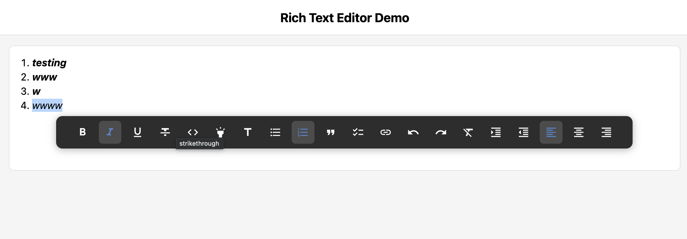

# react-rich-text-editor

A powerful rich text editor for React (web) with support for text formatting, lists, and more. Matches the design and behavior of [@chaitrabhairappa/react-native-rich-text-editor](https://github.com/Chaitra9225/react-native-richtext-editor).

Built with **contentEditable** and pure React — no dependencies on heavy libraries like Draft.js, Slate, or ProseMirror. Lightweight, fast, and easy to integrate.

## Demo

<p align="center">
  
</p>

## Features

- Bold, Italic, Underline, Strikethrough
- Code and Highlight formatting
- Bullet lists and Numbered lists
- Headings
- Quotes and Checklists
- Link insertion
- Undo/Redo
- Text alignment (left, center, right)
- Indent/Outdent
- Floating toolbar with customizable options
- Three variants: outlined, flat, and plain
- Auto-growing height
- `numberOfLines` support for read-only truncation with ellipsis
- **Delta-based content updates** for optimized performance
- **Synchronous style detection** via `onActiveStylesChange`

## Why Delta-Based Updates?

Unlike other editors that send the **entire document** on every keystroke, this library includes **delta information** — only what changed.

```typescript
onContentChange={(event) => {
  // Full content (for saving)
  console.log(event.text);
  console.log(event.blocks);

  // Delta (for optimized processing)
  console.log(event.delta);
  // { type: "insert", position: 50, text: "a" }
}}
```

| Delta Type | When | Data |
|------------|------|------|
| `insert` | User types | `position`, `text` |
| `delete` | User deletes | `position`, `length` |
| `replace` | Selection replaced | `position`, `length`, `text` |
| `format` | Style applied | `position`, `length`, `style` |

**Benefits:**
- **Server sync** — Send only deltas instead of full document
- **Collaborative editing** — Apply remote changes efficiently
- **Analytics** — Track exactly what users type/delete
- **Performance** — Process small changes without parsing entire content

## Installation

```bash
npm install @chaitrabhairappa/react-rich-text-editor
# or
yarn add @chaitrabhairappa/react-rich-text-editor
```

No additional setup required.

## Usage

```tsx
import React, { useRef } from 'react';
import RichTextEditor, {
  RichTextEditorRef,
  Block,
  ContentChangeEvent,
} from '@chaitrabhairappa/react-rich-text-editor';

const App = () => {
  const editorRef = useRef<RichTextEditorRef>(null);

  const handleContentChange = (event: ContentChangeEvent) => {
    console.log('Content changed:', event.blocks);
  };

  const initialContent: Block[] = [
    {
      type: 'paragraph',
      text: 'Hello World',
      styles: [{ style: 'bold', start: 0, end: 5 }],
    },
    {
      type: 'bullet',
      text: 'First item',
      styles: [],
    },
    {
      type: 'bullet',
      text: 'Second item',
      styles: [{ style: 'italic', start: 0, end: 6 }],
    },
  ];

  return (
    <div style={{ padding: 16 }}>
      <RichTextEditor
        ref={editorRef}
        placeholder="Enter text..."
        initialContent={initialContent}
        onContentChange={handleContentChange}
        maxHeight={300}
        variant="outlined"
      />
    </div>
  );
};

export default App;
```

## Props

| Prop                   | Type                                    | Default      | Description                          |
| ---------------------- | --------------------------------------- | ------------ | ------------------------------------ |
| `style`                | `CSSProperties`                         | `undefined`  | Custom styles for the editor         |
| `className`            | `string`                                | `undefined`  | Custom CSS class name                |
| `placeholder`          | `string`                                | `""`         | Placeholder text                     |
| `initialContent`       | `Block[]`                               | `[]`         | Initial content blocks               |
| `readOnly`             | `boolean`                               | `false`      | Make editor read-only                |
| `numberOfLines`        | `number`                                | `undefined`  | Max lines before truncating with ellipsis (read-only) |
| `maxHeight`            | `number`                                | `undefined`  | Maximum height before scrolling      |
| `showToolbar`          | `boolean`                               | `true`       | Show/hide floating toolbar           |
| `toolbarOptions`       | `ToolbarOption[]`                       | All options  | Customize toolbar buttons            |
| `variant`              | `'outlined' \| 'flat' \| 'plain'`       | `'outlined'` | Editor style variant                 |
| `onContentChange`      | `(event: ContentChangeEvent) => void`   | `undefined`  | Called when content changes           |
| `onSelectionChange`    | `(event: SelectionChangeEvent) => void` | `undefined`  | Called when selection changes         |
| `onFocus`              | `() => void`                            | `undefined`  | Called when editor gains focus        |
| `onBlur`               | `() => void`                            | `undefined`  | Called when editor loses focus        |
| `onActiveStylesChange` | `(styles: ActiveStylesState) => void`   | `undefined`  | Called when active styles change      |

## Ref Methods

```tsx
const editorRef = useRef<RichTextEditorRef>(null);

// Content management
editorRef.current?.setContent(blocks);
editorRef.current?.clear();
const text = await editorRef.current?.getText();
const blocks = await editorRef.current?.getBlocks();

// Focus management
editorRef.current?.focus();
editorRef.current?.blur();

// Text styles
editorRef.current?.toggleBold();
editorRef.current?.toggleItalic();
editorRef.current?.toggleUnderline();
editorRef.current?.toggleStrikethrough();
editorRef.current?.toggleCode();
editorRef.current?.toggleHighlight();

// Block types
editorRef.current?.setHeading();
editorRef.current?.setBulletList();
editorRef.current?.setNumberedList();
editorRef.current?.setQuote();
editorRef.current?.setChecklist();
editorRef.current?.setParagraph();

// Actions
editorRef.current?.insertLink(url, text);
editorRef.current?.undo();
editorRef.current?.redo();
editorRef.current?.clearFormatting();

// Indentation
editorRef.current?.indent();
editorRef.current?.outdent();

// Alignment
editorRef.current?.setAlignment('left' | 'center' | 'right');
```

## Types

```typescript
interface Block {
  type: BlockType;
  text: string;
  styles: StyleRange[];
  alignment?: TextAlignment;
  checked?: boolean;
  indentLevel?: number;
}

type BlockType = 'paragraph' | 'bullet' | 'numbered' | 'heading' | 'quote' | 'checklist';
type TextAlignment = 'left' | 'center' | 'right';

interface StyleRange {
  style: 'bold' | 'italic' | 'underline' | 'strikethrough' | 'link' | 'code' | 'highlight';
  start: number;
  end: number;
  url?: string;
  highlightColor?: string;
}

type ToolbarOption =
  | 'bold'
  | 'italic'
  | 'strikethrough'
  | 'underline'
  | 'code'
  | 'highlight'
  | 'heading'
  | 'bullet'
  | 'numbered'
  | 'quote'
  | 'checklist'
  | 'link'
  | 'undo'
  | 'redo'
  | 'clearFormatting'
  | 'indent'
  | 'outdent'
  | 'alignLeft'
  | 'alignCenter'
  | 'alignRight';
```

## Customizing Toolbar

```tsx
import RichTextEditor, { ToolbarOption } from '@chaitrabhairappa/react-rich-text-editor';

const toolbarOptions: ToolbarOption[] = ['bold', 'italic', 'underline', 'bullet', 'numbered'];

<RichTextEditor
  toolbarOptions={toolbarOptions}
  // ...
/>;
```

## License

MIT
